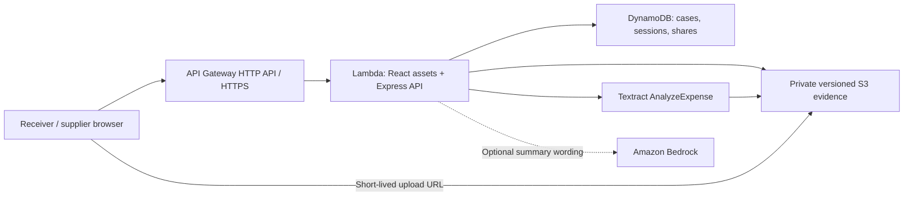

# ReceiveRight

**Know what arrived. Resolve what didn't.**

ReceiveRight brings a delivery invoice, the receiver's counts, supporting photographs, and a supplier's response into one shared record. It is built for small shops receiving packaged goods, where a missing item or damaged packet can otherwise become an unstructured conversation across paper invoices and messages.

Built for **First Commit — AWS × WeMakeDevs, September 2026**. AI-assisted implementation is disclosed below. The included names, invoice, receiving observations, and delivery illustration are synthetic; no customer pilot or recovered-money result is claimed.

| Submission resource | Status |
| --- | --- |
| Source repository | [github.com/Induj1/receiverright](https://github.com/Induj1/receiverright) |
| Public deployment | [Open ReceiveRight](https://ds687e8jj0.execute-api.ap-south-1.amazonaws.com) - live AWS workflow, private S3 evidence and Textract extraction verified. Summaries use deterministic templates. [Verification record](docs/VERIFICATION.md) |
| Video demonstration | Recording/public or unlisted YouTube URL pending. [Recording script](docs/DEMO-SCRIPT.md) |
| Submission answers | [Submission draft](docs/SUBMISSION.md) — replace clearly marked missing team details. |
| API and types | [API contract](API-CONTRACT.md), [shared types](shared/types.ts) |

## Try the complete workflow

1. Open **Explore a sample delivery** in a new workspace.
2. Review the original invoice beside the receiving counts. The sample has three lines:

   | Item | Billed | Physical delivery | Calculated discrepancy |
   | --- | --- | --- | --- |
   | Water | 12 units × ₹100 | 10 received | 2 missing = ₹200 |
   | Biscuits | 24 units × ₹40 | 24 received, including 2 damaged | 2 damaged = ₹80 |
   | Tea | 1 carton × ₹1,200 | 12 individual packets received | Unresolved until carton size is confirmed |

3. Enter **12** as the tea carton size. Verify and confirm each line. The calculated item-value discrepancy is **₹280**, across four affected units. The original invoice item total is ₹3,360.
4. Save, then create a supplier review link. Open the link in another browser or device, and enter its separate six-digit PIN.
5. Acknowledge or dispute each affected line. A dispute requires a reason; the supplied responder name is explicitly self-reported.
6. Return to the receiver record and **Refresh**. Close it after every affected line is acknowledged. Closure records agreement with the observations, not a refund, credit note, payment, or money recovered.

The sample intentionally starts unconfirmed with an unresolved carton conversion. The prefilled sample fixture does not run through Textract. Separately, the synthetic invoice PNG was uploaded to private S3 and processed by the deployed Textract integration, which returned three line items. To test extraction yourself, create a record and upload a supported invoice document you have permission to use.

## What is implemented

- Responsive receiver dashboard, search, status filters, editable invoice metadata, line-item review, and supplier review pages.
- Explicit human confirmation; changes to quantities or prices clear that line's confirmation.
- Original invoice preview, source location overlays when extraction supplies them, delivery photographs, and line-linked evidence.
- JPEG/PNG invoice or photo uploads and PDF invoices; up to 5 MB per upload and 10 evidence files per case.
- Amazon Textract `AnalyzeExpense` integration returning editable candidate fields. Extraction never supplies physical receiving counts or automatically confirms a line.
- Deterministic quantity reconciliation and integer-paise money calculations, including pack conversions and final per-line rounding.
- PIN-protected supplier links, revision-bound sessions, acknowledgement/dispute notes, and activity history.
- JSON/CSV exports, browser print/save-to-PDF, and a case summary using either deterministic text or optional Amazon Bedrock wording.
- Local durable JSON storage for development and a DynamoDB adapter for AWS deployment. The interface reports configured storage, extraction, and summary providers.

## Run locally

Use **Node.js 22 or newer** and npm. From the repository root:

```sh
npm ci
npm run dev
```

Open **http://127.0.0.1:5173**. Vite proxies `/api` to the backend on port 3001. Local mode needs no AWS credentials: manual entry, the synthetic sample, calculations, uploads, supplier review, exports, and template summaries work locally.

For a built local application:

```sh
npm run build
npm start
```

Open **http://127.0.0.1:3001**. This serves the compiled frontend and API from one origin.

Optional backend environment variables can be set in an uncommitted `.env` file:

| Variable | Purpose / default |
| --- | --- |
| `PORT` | Backend HTTP port; `3001`. |
| `HOST` | Local bind address; `127.0.0.1`. |
| `DATA_DIR` | Local JSON records and sealed uploaded files; `.data`. |
| `AWS_REGION` | Region for AWS SDK clients when running with AWS services. |
| `TABLE_NAME` | Enables DynamoDB persistence. If omitted, local JSON storage is used. |
| `EVIDENCE_BUCKET` | Enables versioned private S3 evidence storage. |
| `TEXTRACT_ENABLED` | Explicitly enables Textract when service access is available; the verified AWS deployment enables extraction. |
| `BEDROCK_MODEL_ID` | Optional enabled Bedrock model/inference profile supporting `Converse`. If omitted, summaries use deterministic templates. |
| `MAX_DAILY_AI_CALLS` | Shared daily cap across extraction and Bedrock summaries; `50`. Failed provider calls still consume an attempt. |

AWS SDK clients use the normal credential provider chain. Deployed Lambda should use its IAM role; do not put AWS access keys in frontend code or source control. The local JSON adapter is for one server process, not multiple concurrent workers.

## AWS architecture



The current deployment serves the React assets and Express API through the same API Gateway HTTPS endpoint and Lambda. DynamoDB keeps records and conditional writes; S3 stores private evidence; Textract proposes invoice fields. A deployed `AnalyzeExpense` call successfully returned three line items from the synthetic test invoice. Manual entry remains available. CloudFront is not part of this deployment; API Gateway/Lambda provides the public HTTPS application entry point.

Bedrock model authorization remains unavailable, so the live configuration leaves it disabled and uses deterministic summary templates. Its optional adapter never performs monetary calculations. Initial Textract service activation and CloudFront account restrictions shaped the deployment; the Textract restriction was resolved after the account upgrade. The server's `/api/health` response identifies configured providers. The [verification record](docs/VERIFICATION.md) distinguishes successful live operations from configured or optional capabilities.

S3 evidence is tied to the exact object version checked at attachment time. Later uploads cannot silently change a reviewed evidence version. In local mode the file is sealed into a separate immutable snapshot before attachment.

The deployment implementation is in [infrastructure/template.mjs](infrastructure/template.mjs) and [scripts/deploy.mjs](scripts/deploy.mjs). With an authenticated AWS CLI profile and the required service permissions:

```sh
npm run build
npm run build:lambda
node scripts/deploy.mjs
```

The script defaults to AWS profile `receiverright`, region `ap-south-1`, and stack `receiverright`; override them with `AWS_PROFILE`, `AWS_REGION`, and `STACK_NAME`. It writes local `deployment-outputs.json` containing the resulting service endpoints. AWS resources and provider calls can incur charges; the daily AI-call cap is a request limit, not a guaranteed currency budget.

## Calculation rules

Receiving counts are whole physical units. `received` includes damaged and wrong items. A unit can be classified as damaged **or** wrong, not both.

```text
expected units = billed quantity × confirmed units per billed pack
accepted units = received − damaged − wrong
shortage       = max(expected − received, 0)
excess         = max(received − expected, 0)
affected units = shortage + damaged + wrong
item value     = round(affected units × billed-unit price / pack size)
```

Unit prices are integer paise. Integer arithmetic rounds half up only after the complete line calculation; it does not round a per-piece price first. A known zero price is valid. Missing price or count is distinct from zero. Carton/pack conversions must be confirmed. Overdelivery combined with damaged/wrong units needs separate allocation and blocks sharing, avoiding an automatic claim against possibly compensating surplus units.

Taxes, discounts, weighed/fractional goods, credit-note creation, inventory accounting, and payment settlement are outside this version. An image documents a reported observation; it cannot prove hidden or absent quantities. OCR and generated wording remain suggestions that require review.

## Access and record consistency

- A server-generated random receiver token grants access to one workspace. It is held in this browser's local storage and expires after seven days. This is a prototype browser workspace, not a recoverable user account. Export important records before clearing browser data or switching workspaces.
- Supplier links expire after 48 hours, require a separate six-digit PIN, and grant access to one case revision. Five incorrect PIN attempts lock the link for 15 minutes; unlocked supplier sessions expire after at most two hours.
- Tokens and PIN checks are stored as hashes. The supplier's typed name is **not independently verified**.
- Edits and new evidence increase the case revision, clear current responses, and invalidate old review links. Concurrent writes use conditional storage versions and return a conflict instead of silently overwriting another saved change.
- Evidence access requires the receiver workspace token or a current supplier session for that case. AWS downloads use short-lived signed URLs.
- Closed records cannot be changed through the API. The activity list retains the most recent 200 events; it is not a legally certified or cryptographically immutable audit ledger.
- General HTTP rate limits supplement a durable shared daily AI-call budget. The demo has a 25-case workspace limit. Deployments still need operator-managed usage monitoring, retention, and deletion policies before handling production customer documents.

## Verification

```sh
npm test
npm run typecheck
npm run build
```

Domain tests cover shortages, exclusive damage/wrong allocation, missing observations, pack conversion, zero-price items, rounding, invalid inputs, overflow, and conservative excess handling. API tests cover the full receiver/supplier lifecycle, workspace and evidence scope, stale edits and links, PIN lockout, upload validation/idempotency, CSV escaping, restart persistence, and the daily provider-call budget. Local tests use local storage and controlled provider doubles; they do not establish live AWS accuracy or a real-world customer outcome.

## AI assistance and evidence

The project was implemented with substantial **OpenAI Codex assistance**, including code, test cases, interface work, documentation, and review. The project owner supplied the problem direction and scope. Team contribution statements should describe what each teammate actually did; placeholders in the submission draft are not completed contributions.

All bundled demonstration records and visual evidence are synthetic and labeled in the app. There is no claim of a real shop pilot, extraction accuracy percentage, time saved, recovered revenue, or guaranteed competition result. Measured user outcomes can be added only after a documented trial.
