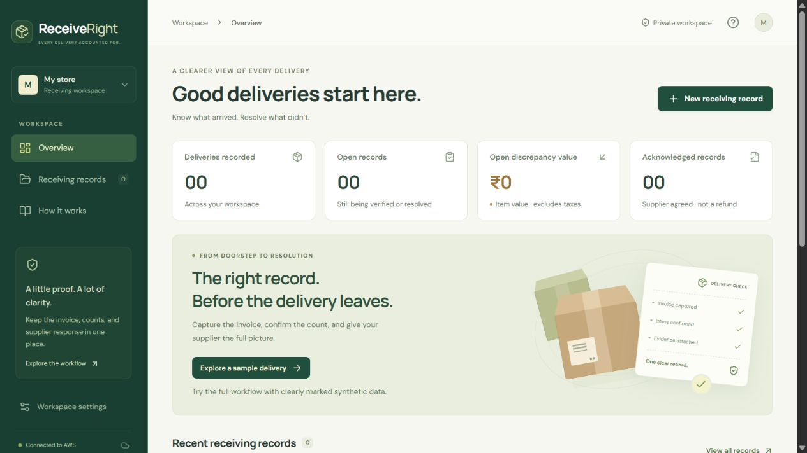
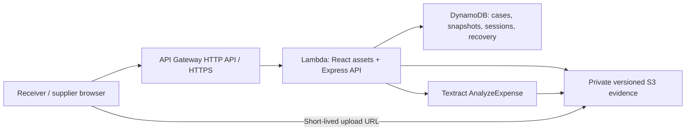

# ReceiveRight

**One shared record for a delivery that does not match its invoice.**

ReceiveRight helps a small shop check packaged goods at delivery and give its supplier a specific discrepancy to review. The invoice, physical counts, photographs, calculation, and supplier response stay connected to the **same saved version**. Later edits preserve the earlier record and its responses.

Built by **Bro code** for **First Commit - AWS x WeMakeDevs, September 2026**, Ship It track. [Open the deployed app](https://ds687e8jj0.execute-api.ap-south-1.amazonaws.com) · [Two-page project brief](output/pdf/ReceiveRight-Submission-Brief.pdf) · [Submission answers](docs/SUBMISSION.md)



*Actual deployed interface; all bundled demonstration data is synthetic.*

## Why this workflow

An invoice photo and a message can start a conversation. ReceiveRight adds a structured record of **which item, how many physical units, which evidence, what calculated item value, and which version the supplier reviewed**. That is the product hypothesis: both parties can work from the same discrepancy instead of reconstructing it from separate messages. A shop/supplier trial is still needed to test whether this is useful in practice.

| Decision at the receiving desk | What the application does |
| --- | --- |
| The invoice says "one carton"; the shop counted packets | Requires a confirmed pack size before calculating or sharing. |
| Two damaged packets are included in the physical count | Separates shortage from damage so the same unit is not counted twice. |
| The receiver corrects a count after the supplier replied | Preserves old quantities and responses, creates a new revision, and invalidates the old review link. |
| The receiver returns on a different browser | Restores the workspace with a privately saved recovery code. |

## Try the core workflow

1. [Open ReceiveRight](https://ds687e8jj0.execute-api.ap-south-1.amazonaws.com) and choose **Explore a sample delivery**.
2. Review the three synthetic invoice lines beside their receiving counts. The water line has two missing units; the biscuits line has two damaged units already included in the 24 received.
3. Enter **12** as the tea carton size, check the invoice and counts, confirm each line, and save. The item-value discrepancy is **INR 280**: INR 200 for the water plus INR 80 for the biscuits.
4. Create a supplier review link. Open it in a separate browser or device and unlock it with the separate PIN. Acknowledge or dispute each affected line.
5. Return to the receiver view and refresh. Inspect **Saved history**; a later edit preserves the earlier record and supplier responses. When every affected line is acknowledged, close the record.
6. Open **Workspace access**, generate a recovery code, and save it privately outside this browser. Use it to restore the same workspace after a session expires or on another device.

Closing records agreement with the observations. It does not record a refund, credit note, payment, or recovered money. The prefilled sample is synthetic and does not pretend to be a fresh Textract result.

## What is working

- Responsive receiver workspace, item review, search, status filters, private source preview, and line-linked delivery photographs.
- Explicit human confirmation and whole-unit/pack conversion rules; changed quantities and prices clear confirmation.
- Real Amazon Textract `AnalyzeExpense` extraction. Missing or uncertain quantity and price remain blank; an unidentified unit stays unknown. The original invoice remains available for correction.
- Deterministic integer-paise calculation, provisional values, conservative overdelivery handling, and CSV/JSON/print exports.
- PIN-protected supplier review, acknowledge/dispute decisions, stale-link protection, and read-only saved states containing historical quantities, evidence references, and supplier responses.
- Recoverable workspaces with a privately saved code, code replacement, and seven-day session renewal.
- Private, versioned evidence uploads and downloads; DynamoDB conditional writes and transactional snapshot creation.

## Evidence, including the failures

**102 automated tests passed**, covering domain rules, API behavior, extraction parsing, recovery, and saved history. The production frontend and Lambda bundle built successfully. The [verification record](docs/VERIFICATION.md) links reproducible checks and distinguishes software behavior from customer outcomes.

A live AWS smoke run verified recovery and renewal, the supplier workflow, retained responses after a later edit, historical evidence access, closure, and exports. [Sanitized results](docs/deployed-smoke.json)

We also submitted **five generated invoice images** through the deployed API and real Textract. It returned **12 of 13 printed rows**. Three fixtures matched all four scored fields on every row; an intentionally incomplete invoice lost an entire row, and two units were unknown in the Indian-price fixture. That failure matters: a person must compare the full invoice with the suggested list and add omitted items. The [evaluation report](docs/INVOICE-EVALUATION.md), [raw measured results](docs/evidence/invoice-evaluation.json), [images and ground truth](public/evaluation/expected.json), and [generator](scripts/generate-evaluation-corpus.py) are public. This tiny synthetic set is not a representative accuracy benchmark.

The live interaction video is being finalized. Its final publishing status belongs in [video publishing details](docs/VIDEO-PUBLISHING.md). A [shop/supplier trial protocol](docs/USER-TRIAL.md) and [team learning worksheet](docs/TEAM-LEARNING.md) are prepared; uncompleted trials and teammate contributions are not claimed.

## AWS architecture and cost



Five AWS services perform the deployed workflow: **API Gateway, Lambda, DynamoDB, S3, and Textract**. API Gateway and Lambda provide one HTTPS origin for the React interface and Express API. DynamoDB stores records and append-only saved states; private S3 keeps each evidence attachment tied to its checked object version; Textract proposes invoice fields. Manual entry and deterministic summaries work without an AI call.

The [operating-cost model](docs/OPERATING-COST.md), using Mumbai AWS catalog rates retrieved on 20 September 2026, estimates a **USD 10.35 core-service subtotal for 1,000 one-page invoices under stated workload assumptions**. It excludes S3 requests, logs, transfer, deployment artifacts, operations, and taxes. This is not total cost of ownership or a spending cap. The largest modeled component is one Textract page per invoice. Extraction is user-triggered, and a shared daily quota limits provider attempts to 50.

CloudFront is not deployed; an account restriction led to API Gateway/Lambda hosting. An optional Bedrock summary adapter remains disabled because model authorization was unavailable. Neither service is counted as a working integration. The [deployment guide](docs/DEPLOYMENT.md) explains the deployed configuration and account lessons.

## Run or deploy

Use **Node.js 22 or newer**:

```sh
npm ci
npm run dev
```

Open **http://127.0.0.1:5173**. Vite proxies `/api` to the backend on port 3001. Manual entry, the sample, calculations, local uploads, supplier review, recovery, history, and exports work without AWS credentials. Local JSON storage supports one server process.

```sh
npm test
npm run build
npm start
```

The built local application is served on **http://127.0.0.1:3001**. The [API contract](API-CONTRACT.md) and [shared types](shared/types.ts) describe the interfaces.

For AWS, authenticate the CLI, follow the [deployment guide](docs/DEPLOYMENT.md), and run:

```sh
npm run build
npm run build:lambda
node scripts/deploy.mjs
```

Set `TEXTRACT_ENABLED=true` in the deployment environment, including updates. The script defaults to profile `receiverright`, region `ap-south-1`, and stack `receiverright-app`; `AWS_PROFILE`, `AWS_REGION`, and `STACK_NAME` override them. Leave `BEDROCK_MODEL_ID` empty for the verified template-summary configuration. AWS usage can incur charges.

| Backend setting | Purpose |
| --- | --- |
| `PORT`, `HOST` | Local server; defaults to `3001`, `127.0.0.1`. |
| `DATA_DIR` | Local storage; defaults to `.data`. |
| `TABLE_NAME` | Enables DynamoDB persistence. |
| `EVIDENCE_BUCKET` | Enables private, versioned S3 storage. |
| `TEXTRACT_ENABLED` | Enables extraction when AWS access is available. |
| `MAX_DAILY_AI_CALLS` | Shared daily provider-attempt cap; defaults to `50`. |

AWS SDKs use the normal credential chain, and deployed Lambda uses its IAM role. Never put access keys in frontend code, screenshots, or source control.

## Calculation rules

Receiving counts are whole physical units. `received` includes damaged and wrong items; a unit may be classified as one or the other, not both.

```text
expected units = billed quantity x confirmed units per billed pack
accepted units = received - damaged - wrong
shortage       = max(expected - received, 0)
excess         = max(received - expected, 0)
affected units = shortage + damaged + wrong
item value     = round(affected units x billed-unit price / pack size)
```

Integer-paise arithmetic rounds half up once per complete line. A known zero is valid; an unknown quantity, price, or unit cannot become a monetary claim. Pack conversion requires confirmation. Excess combined with damaged/wrong items blocks sharing until allocation is clarified.

## Scope and limitations

- **Receiving records, not inventory or payments.** Taxes, discounts, weighed goods, credit notes, and settlement are outside this version. Photographs document reported observations; they cannot prove hidden or absent quantities.
- **OCR is a candidate list.** It can omit whole rows. Low-confidence or ambiguous numeric fields stay blank; multi-invoice files, foreign currency, and more than 100 extracted rows are rejected explicitly. Check the whole original invoice before confirmation.
- **Recovery depends on the saved code.** Browser sessions last seven days and can be renewed. The code restores the same workspace and grants full access, so save it privately. It must be generated before access is lost; this is not email-based identity recovery. Replacing a code invalidates the old code but does not revoke existing unexpired sessions.
- **Supplier identity is self-reported.** Links last 48 hours, require a separate PIN, and bind to one revision. Five wrong attempts lock a link for 15 minutes. The typed responder name is not independently verified.
- **History has explicit bounds.** The application preserves up to 1,000 saved states per case; the activity view holds the latest 200 events. Older records retain the migration baseline and subsequent states, not invented pre-migration history. This is an application archive, not a legally certified immutable ledger.
- **Hackathon operating limits apply.** Workspaces hold up to 25 cases; a case supports 100 lines and 10 evidence files of up to 5 MB each. Production use needs retention/deletion policy, identity controls, spending monitoring, and wider document/device testing.
- **User validation is pending.** No real-shop pilot, time saving, recovered revenue, adoption, or competition result is claimed. The [trial protocol](docs/USER-TRIAL.md) states what evidence to collect next.

## Team and AI assistance

**Bro code:** Harshita Nagesh, Rayyan Shaikh, Induj Gupta, and Laavanya gupta. Submission leadership and individual contribution statements must follow the final verified team details.

OpenAI Codex substantially assisted implementation, tests, interface work, documentation, and review. That assistance is disclosed. The team should record what each person actually inspected, tested, changed, and learned in [TEAM-LEARNING.md](docs/TEAM-LEARNING.md); proposed responsibilities are not completed contributions.
