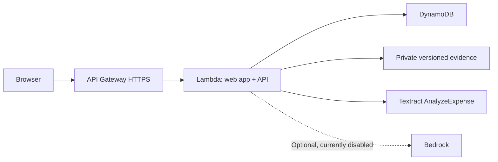

# When an invoice says "carton," the arithmetic needs a human

*AWS Builder Center draft. Not published. [Source](https://github.com/Induj1/receiverright) · [Deployed app](https://ds687e8jj0.execute-api.ap-south-1.amazonaws.com). Live AWS workflow, private evidence and Textract verified. Summaries use deterministic templates.*

We built ReceiveRight around a small moment: a shop receives a delivery, and someone needs to decide whether what arrived matches the invoice. The original document, physical counts, photographs, and supplier's reply should be easy to understand together. Our project turns those pieces into one receiving record.

We started with a deliberately synthetic example. Twelve water bottles were billed at ₹100 each, but ten were recorded as received. Twenty-four biscuit packets arrived, including two marked damaged at ₹40 each. A tea invoice said one carton, while the receiver counted twelve packets. The missing bottles and damaged biscuits suggest ₹280 of item-value discrepancy. The tea line cannot be reconciled until someone confirms the carton size.

That last detail shaped the application more than a model choice did.

## Separate an invoice from an observation

An invoice states what was billed. OCR can suggest what the document says, but it cannot tell us what was physically delivered. We kept those inputs separate. Amazon Textract's `AnalyzeExpense` adapter returns candidate descriptions, quantities, unit prices, and source locations. Received counts remain empty until a person supplies them. Applying extraction suggestions does not confirm the receiving record.

We put the original invoice beside editable lines, and require an explicit check on each item. Changing a quantity or price clears that line's confirmation. For cartons, packs, or boxes, the receiver must also confirm how many individual units correspond to the billed unit. Missing information stays visible instead of becoming an assumed zero.

Our bundled sample is labeled synthetic. Separately, the deployed Textract integration processed the synthetic invoice PNG and returned three line items. That verifies one input, not general extraction accuracy or a customer delivery.

## Make the calculation inspectable

We use whole physical units and integer paise. The physical received count includes damaged and wrong items, with those two classifications kept mutually exclusive. Shortage is the positive difference between expected units and received units. The affected count adds shortage, damaged units, and wrong units.

This avoids counting a damaged packet as both missing and damaged. Pack pricing introduces another subtlety: dividing a billed pack price can produce fractional paise. We calculate the complete line value first and round once, using integer arithmetic. A known zero price is valid; an absent price is unresolved.

We also block the combination of excess delivery and rejected items until the allocation is clarified. If surplus units might offset damage, automatically turning every rejected unit into a financial claim would be misleading. The application reports item values only. Tax, discounts, credit notes, and payment settlement are outside this version.

## Agreement must refer to one version

The useful outcome is a shared record that the supplier can respond to. ReceiveRight creates a link with a separate six-digit PIN. After unlocking it, the supplier can inspect evidence and acknowledge or dispute each affected line. Disputes require an explanation. The responder's typed name is recorded as self-reported, not treated as a verified legal identity.

Each invitation belongs to one revision. Editing the record or attaching new evidence increases its revision and invalidates previous review links. DynamoDB conditional writes handle a separate problem: two simultaneous requests should not silently overwrite each other. We keep the business revision and storage version separate because a supplier response changes workflow state without changing the invoice quantities being reviewed.

Evidence needs the same care. We attach the checked S3 object version, so a later upload cannot silently replace the file behind an existing observation. Uploaded files remain private and are opened through authorized, short-lived access.

## Adapt the AWS deployment honestly

Our original hosting plan used CloudFront with S3, but initial account verification restricted that path. Textract returned `SubscriptionRequiredException` until an account upgrade resolved access. We then verified actual extraction through the deployed application. Bedrock still returned an operation-not-allowed error, so we kept its adapter disabled.

The deployed path uses API Gateway invoking Lambda, which serves both the React interface and Express endpoints. DynamoDB persists records and sessions; private, versioned S3 holds evidence; Textract supplies editable invoice suggestions. Manual entry remains available, and summaries use deterministic templates.

This also sharpened our AWS feedback. Account-readiness checks surfaced before deployment would help builders plan around service gates. For S3, a complete browser-upload example covering CORS, signed content length, versioning, and version-specific review would reduce integration work. We found that the upload, attachment, and review steps have to be considered together.

## Test the decisions that matter

Our 33 automated tests cover pack ambiguity, missing observations, rounding, invalid allocations, workspace separation, stale revisions, PIN lockout, private evidence, upload idempotency, and the receiving lifecycle. A separate live AWS smoke test verified the supplier response and closure, the ₹280 export, a byte-for-byte S3 evidence round trip, and three Textract invoice lines. A durable counter limits daily AI calls.

We used OpenAI Codex substantially for implementation, interface work, tests, documentation, and review. That assistance is disclosed. Automated tests establish specific software behavior; they do not establish extraction accuracy, customer adoption, or money recovered.

The next evidence we need is a documented receiving trial with a real shop and supplier. For now, ReceiveRight demonstrates a narrower, verifiable result: a person can reconcile a delivery, share the exact evidence and quantities they reviewed, and record the supplier's response. Closing that record means the observations were acknowledged. It does not mean a refund happened.
