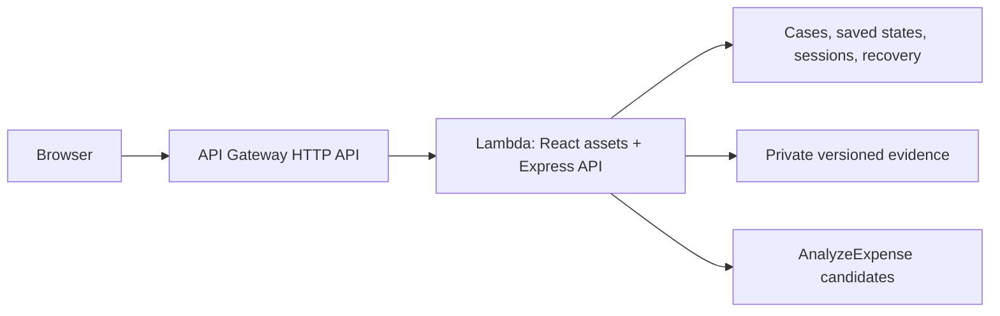

# A supplier's "yes" should refer to the same delivery record

*AWS Builder Center draft by Bro code. Not published. Individual author and personal learning statements must be confirmed before publication. [Source](https://github.com/Induj1/receiverright) · [Live ReceiveRight](https://ds687e8jj0.execute-api.ap-south-1.amazonaws.com)*

A shopkeeper sends an invoice photograph and says two packets arrived damaged. The supplier replies "okay." Then the receiving count changes. Which version did the supplier agree with?

That is the situation ReceiveRight is designed to clarify. It brings the original invoice, physical counts, photographs, calculated item value, and supplier response into one saved delivery record. The intended benefit is a shared reference that both parties can inspect. We have built and tested that workflow; we still need a real shop/supplier trial to establish whether it improves their current process.

Our synthetic example is deliberately small. Twelve water bottles were billed at INR 100 each, but ten were recorded as received. Twenty-four biscuit packets arrived, including two marked damaged at INR 40 each. One tea carton arrived as twelve individual packets. The first two lines yield INR 280 of item-value discrepancy; the tea line needs a confirmed carton size. This is a calculation example, not money recovered.

## Keep the invoice separate from physical observations

Amazon Textract `AnalyzeExpense` supplies candidate invoice fields. It cannot observe what was delivered. ReceiveRight therefore leaves physical received counts blank after extraction, leaves every line unconfirmed, and asks the receiver to compare the suggestions with the source document.

Missing billed quantities use `null`, not zero. An unidentified billed unit is `unknown`, not a piece. Low-confidence numeric suggestions, conflicting fields, combined expressions such as `12 x 500`, and ambiguous numeric punctuation remain unresolved. The parser accepts explicit units but does not infer a carton size from the product name. Missing unit price is not filled using the extended line total.

The parser also rejects multiple invoices in one result and more than 100 detected rows with explicit messages. It never quietly uses only the first invoice or drops rows beyond a limit. These rules trade some automatic completion for an inspectable draft.

Our five-image synthetic evaluation found a different failure: Textract omitted a complete row when its quantity was blank. A parser cannot preserve a row it never receives. We now state that limitation directly in the extraction dialog: compare the entire original invoice with the suggested list and add omitted items. Unknown fields and missing rows need different checks.

## Make the arithmetic explainable

We use whole physical units and integer paise. The received count includes damaged and wrong items, and those classifications must not overlap. Shortage is the positive difference between expected units and physical received units. The affected count adds shortage, damage, and wrong items.

This avoids counting a damaged packet as both missing and damaged. For a pack-priced invoice, the complete line amount is calculated before rounding; dividing into a prematurely rounded per-piece price can produce a different total. A known zero price remains valid. An absent quantity, unit, or price remains unresolved.

Excess delivery combined with damage or wrong items blocks sharing until allocation is clarified. Surplus items may offset rejected units, so the application should not automatically turn every rejection into a financial claim. ReceiveRight reports item-value discrepancies; tax, discounts, weighed goods, credit notes, and settlement remain outside this version.

## Preserve the version behind an acknowledgement

Supplier links have a separate PIN and refer to one case revision. The supplier acknowledges or disputes each affected line; a dispute requires a reason. Its typed responder name is self-reported, not a verified identity.

Changing the record clears the current review state and invalidates old invitations. Crucially, that no longer means losing the older response. DynamoDB transactions save the updated record together with a separate, append-only snapshot and index. The history view opens the earlier quantities, evidence references, and supplier responses as a read-only state. Conditional writes reject a stale edit instead of silently replacing a newer one.

Private S3 evidence follows the same principle. An attachment points to the exact object version checked when it was attached. A later upload cannot silently replace that historical reference. A live test confirmed that evidence from an earlier saved state remained privately downloadable after a later edit.

This is application-level history, with a 1,000-state bound per case. It is not a legally certified immutable ledger. Existing records start from their available migration baseline; the application does not invent earlier history.

## Let the receiver return

A delivery discrepancy may outlast a browser session. ReceiveRight now offers a privately saved recovery code that restores the same workspace on another browser or after a session expires. Active sessions last seven days and can be renewed. Replacing a recovery code invalidates the old code; existing signed-in sessions continue until expiry.

The code grants workspace access, so it is shown once and must be saved outside the current browser. This is a practical prototype recovery mechanism, not email-based identity verification. Losing both browser access and an unsaved code still prevents recovery.

## Use AWS for the work the record requires

Five AWS services run the deployed path. API Gateway and Lambda serve the app and API from one HTTPS origin. DynamoDB persists the workflow and conditional transactions. S3 stores private versioned evidence. Textract suggests document fields. Manual entry, deterministic calculations, and template summaries do not need an AI call.

Account restrictions shaped hosting: CloudFront was unavailable, so API Gateway/Lambda became the application entry point. Textract access worked after account setup was resolved. An optional Bedrock adapter remains disabled and is not claimed as a working integration. Clearer account-readiness diagnostics before deployment would have saved integration effort.

The [cost model](OPERATING-COST.md) uses Mumbai catalog rates and explicit workload assumptions: one Textract page, 30 requests, and stated compute/storage/transaction allowances per invoice. For 1,000 one-page invoices, the core-service subtotal is about USD 10.35. It excludes request categories and operational costs listed in the model, so it is not a full bill or total cost of ownership. Extraction is explicit, and a shared 50-attempt daily quota limits provider calls, not all AWS spending.

## Measure the narrow claims

The project has 103 passing automated tests across receiving arithmetic, parsing, API behavior, recovery, and saved history. The live AWS smoke run exercised recovery, renewal, a supplier acknowledgement, later edits with retained responses, historical evidence, closure, and exports. A recorded browser walkthrough separately exercised invoice upload, real extraction, unit correction, supplier responses, closure, historical states, and restoration of the same workspace.

Separately, all five generated invoice images completed extraction through the deployed API in 1.704-2.011 seconds from one client. Textract returned 12 of 13 printed rows. Three fixtures matched every scored line field. The incomplete invoice lost a row, two units in the Indian-price fixture stayed unknown, and invoice identifiers also needed review. The [full results and scoring method](INVOICE-EVALUATION.md) preserve those failures. These images are a tiny convenience sample, not representative OCR accuracy or a load test.

OpenAI Codex substantially assisted code, interface work, tests, documentation, and review. That assistance is disclosed. The team's individual learning record must describe work each person actually performed.

The next validation is a documented task with a shopkeeper and supplier: can each find the necessary evidence, understand what an acknowledgement means, and complete the workflow without coaching? A [trial protocol](USER-TRIAL.md) is ready. Until that occurs, our demonstrated result is specific: the deployed application can create, recover, revise, and share a delivery discrepancy record while keeping the supplier's response attached to the version reviewed.
